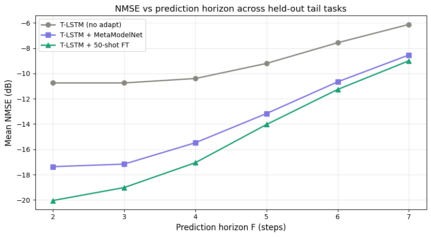
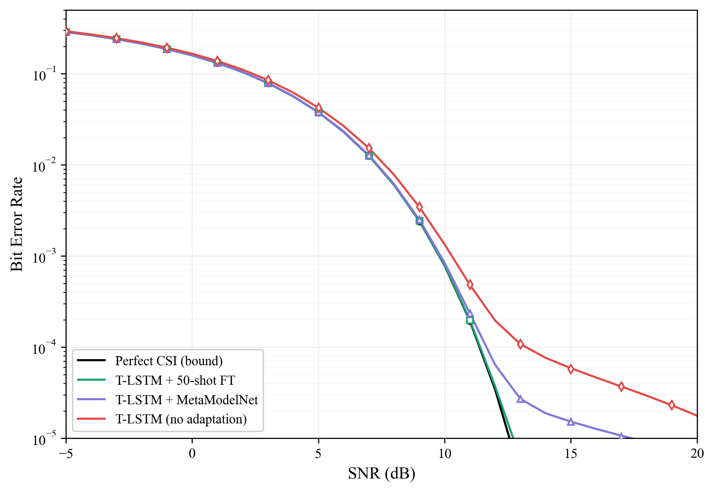

# MetaModelNet for LEO Satellite Channel Prediction

Gradient-free meta-learning for adapting a pre-trained channel predictor to rare, unseen "tail" channel conditions (low-elevation, urban/vehicular) in Low Earth Orbit links, without any test-time gradient computation.

## Overview

Channel aging is a core problem for LEO links: by the time channel state information (CSI) is acquired and fed back, the channel has already moved on. A hybrid Transformer-LSTM (T-LSTM) predictor handles the common ("head"/"body") conditions well, but degrades on rare tail conditions that are underrepresented in training.

This repository implements **MetaModelNet (MMN)**, a meta-network that learns a transformation in the *weight space* of the T-LSTM decoder. Given a small k-shot adaptation of the decoder on a new tail task, MMN predicts the fully-adapted weights in a single forward pass — no test-time gradients required. The result is near-fine-tuning accuracy at a fraction of the inference cost.

The pipeline spans a MATLAB satellite-constellation simulation (Starlink-like geometry, Rician fading, UPA, Doppler) and a PyTorch implementation of the predictor and meta-network.

## Key Results

Evaluated on 24 held-out tail tasks, averaged over 5 seeds, prediction horizons Fh = 2 to 7.

| Method                       | NMSE (dB)      | Tail-task win rate |
|------------------------------|----------------|--------------------|
| T-LSTM, no adaptation        | ~-9.4          | baseline           |
| T-LSTM + MetaModelNet        | ~-16.0 ± 0.21  | 24 / 24            |
| T-LSTM + 50-shot fine-tuning | ~-16.3 ± 0.08  | 24 / 24            |

- MMN matches supervised fine-tuning to within ~0.3 dB while being roughly **452x faster** at adaptation time (single forward pass vs iterative fine-tuning).
- **Bit error rate** floors: baseline ~1.67%, MMN ~1.21%, 50-shot FT ~1.06%. MMN recovers ~63% of the baseline rate loss.
- Achievable-rate gap closed to ~0.07–0.08 bits/s/Hz at 10 dB.





## Repository Structure

```
.
├── matlab/                  # Constellation + channel simulation
│   ├── CalculateSatellitesLocation.m
│   ├── RicianChannel.m
│   ├── Metalearning_prep.m  # builds MetaLearning_Dataset.mat
│   └── ...                  # geometry, Doppler, steering-vector helpers
├── training.ipynb           # Canonical notebook: train + evaluate + BER
├── figures/                 # Result figures
├── requirements.txt
└── README.md
```

The canonical notebook is **`training.ipynb`**. Run it top to bottom for the full pipeline.

## Requirements

- Python 3.10+
- PyTorch (CUDA 12.1 build for GPU training; CPU/MPS also work for evaluation)
- numpy, scipy, h5py, matplotlib
- MATLAB for regenerating the dataset (not needed if you use the released `.mat`)

```bash
pip install torch numpy scipy h5py matplotlib
```

For the CUDA 12.1 GPU build specifically:

```bash
pip install torch --index-url https://download.pytorch.org/whl/cu121
```

## Data & Weights

The dataset and trained weights are released separately (large binaries do not belong in git history):

- `MetaLearning_Dataset.mat` — 7-field dataset (head/body/tail chunks with `fc` and `Difficulty` fields)
- `best_model.pt` — pre-trained base T-LSTM
- `meta_net.pt` — trained MetaModelNet
- `trajectories_pca.pt` — weight-space trajectories (optional, for the PCA cell)

**Download:** *Zenodo link coming soon*

Place all four files in the same directory as `training.ipynb` before running (the notebook uses relative paths).

## Reproducing the Results

1. Download the dataset and weights and place them alongside `training.ipynb`
2. Open `training.ipynb`
3. Run all cells top to bottom (Restart & Run All)

The notebook trains the base T-LSTM, trains MMN, evaluates on 24 tail tasks, and produces the NMSE, horizon-sweep, latency, and BER/rate results in order.

To regenerate the dataset from scratch, run the MATLAB pipeline (`Metalearning_prep.m` and dependencies) to produce `MetaLearning_Dataset.mat`.

## Configuration Notes

These settings are deliberate and load-bearing; changing them silently degrades results:

- **Per-task normalisation** is intended. Global normalisation breaks the meta-learning pipeline and must not be substituted.
- **`sample_sizes = [50, 800]`** (single MMN block) is the correct configuration. The multi-block `[50, 100, 200, 400, 800]` variant is an ablation only and gives worse results.
- Channels are **unit-normalised** before BER/rate computation. Raw LEO channels have norms on the order of 1e-9; skipping normalisation causes path-loss underflow and meaningless metrics.

## Citation

*This work is under review. BibTeX entry will be added on acceptance.*

## License

MIT License — see [LICENSE](LICENSE) for details.

## Acknowledgements

This work was carried out at the Wolfson School of Mechanical, Electrical and Manufacturing Engineering, Loughborough University, under the supervision of Dr Mahsa Derakhshani.